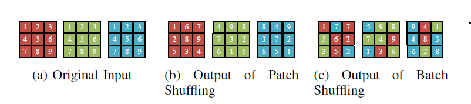
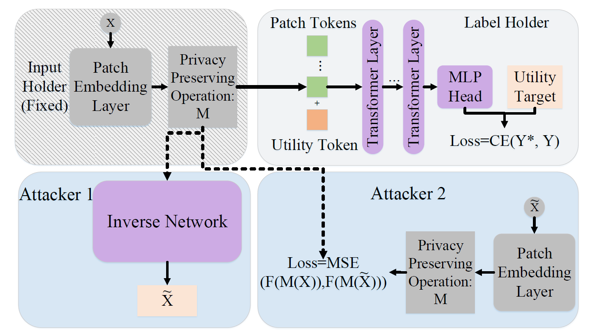
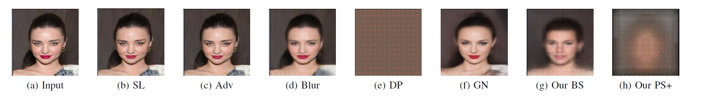
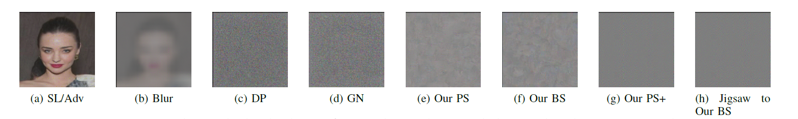

# Privacy-Preserving Split Learning via Patch Shuffling over Transformers
  
Official Code for ICDM 2022 paper: Privacy-Preserving Split Learning via Patch Shuffling over Transformers  
[Dixi Yao](https://dixiyao.github.io/), Liyao Xiang, Hengyuan Xu, Hangyu Ye, Yingqi Chen  
[[Paper]]() [[BibTex]]()

## Requirements
```torch, torchvision, timm, eniops,pyyaml```

## API of Patch Shuffling
### PatchShuffle
function: ```utilsenc.PatchShuffle(x)->y```  
x: input feature; y: outputfeature
### BatchShuffle  
function: ```utilsenc.BatchPatchPartialShuffle(x,k1)->y```  
x: input feature; k: proportions of patches not to be shuffle; y: outputfeature
### SpectralShuffle
The function is the same as PatchShuffle or BatchShuffle, but first turn models into spectral domain. Please see the example as reference.
### How to use?
Place the API of PatchShuffle, BatchShuffle or SpectralShuffle at any place you want to shuffle to feature, in your torch models.  

Normally, in our implementation of privacy-preserving split learning, we place the shuffling operation before the first block of transformer and adding class token.  

For example:  
The model placed on the edge $F$.
```
class F(torch.nn.Module):
    def __init__(self,net,k=1):
        super(F, self).__init__()
        self.model=net
        self.k=k

    def forward_features(self, x):
       with torch.no_grad():
             x = self.model.tokens_to_token(x)
            x =utilsenc.BatchPatchPartialShuffle(x,self.k1,self.k2)
            cls_token = self.model.cls_token.expand(x.shape[0], -1,-1)  # stole cls_tokens impl from Phil Wang, thanks
            x = torch.cat((cls_token, x), dim=1)
            x = self.model.blocks[:1](x)
            x =x[:,1:,:]

    def forward(self, x):
        x= self.forward_features(x)
        return x[:,1:,:]

```
The model placed on the Cloud, F'
```
class rest_F(torch.nn.Module):
    def __init__(self,net,cut_layer):
        super(rest_F, self).__init__()
        self.model = net
        self.cut_layer=cut_layer

    def forward_features(self, x):
        x  = self.model.blocks[self.cut_layer:](x)
        x = self.model.norm(x)
        return x[:, 0]

    def forward(self, x):
        x= self.forward_features(x)
        x = self.model.head(x)
        return x
```
In the model on the edge, we place the shuffling right before adding class token as model strtucture we introduced in our paper.

## Examples
Here are somple example codes, showing how to use our PatchShuffling/BatchShuffling/SpectralShuffling, also reproduction of results in paper.
### Training
**Train over CelebA/LFW/Cifar10/Cifar100**  
[T2T](https://github.com/yitu-opensource/T2T-ViT) is our backbone model. So part of the codes is built based on T2T-VIT and [timm](https://github.com/rwightman/pytorch-image-models) models.  
First, download the [T2T-ViT-24](https://github.com/yitu-opensource/T2T-ViT/releases/download/main/82.3_T2T_ViT_24.pth.tar) into the checkpoints folder (suggested).  
Then you can train CelebA with BatchShuffling $k=0.4$:
```
python3 main.py --dataset=celeba --k=0.4 --b 64 --datapath=your-path-to-dataset
```
Or you can train Cifar with PatchShuffling:
```
python3 main.py --dataset=cifar10 --k=1. --b 64 --datapath=your-path-to-dataset
```
The argument $k$ here is the same $k$ in the paper. If $k=1$, it is patch shuffling. If $k<1$, it is batch shuffling.  

**Train with SpectralShuffling**  
The training with spectral shuffling is very similar to on the time domain. We just need to turn the computing into
spectral domain.
```
python3 main.py --dataset=celeba --k=1. --b 64 --datapath=your-path-to-dataset
```

**Train DIFM**  
coming sone

## Verify Privacy with Attackers
Here are code samples for training adveraries.  
Requirements for attackers ```torchlightning, facenet,facenet-pytorch,transformers,pytorch-msssim```   
### BlackBox Attack
Under the folder BlackBoxAttacker, you can directly run  
```
python main.py
```  
to test the attacker's Generator
### WhiteBox Attack
The main logic idea is following the idea of Unsplit[4]. WhiteBox Attack is under folder WhiteBoxAttacker, you can run with following  
```
python3 whitebox.py --dataset=celeba --k=0.4 --b 64 --datapath=your-path-to-dataset
```
### Adaptive Attack
It is similar to the black box attack. Place the```model.py``` with the one under AdaptiveAttacker. Then you can run the same code with BlackBox atack to 
realize adaptive attack

### Pre-trained Model
You can download some trained models here  
| Model    | Download|
| :---      |  :---:   | 
| CelebA BS 40   | [here](https://github.com/dixiyao/PatchShuffling/releases/download/TrainedModel/Cifar10_PS75.pth) |
| CelebA PS+     |[here](https://github.com/dixiyao/PatchShuffling/releases/download/TrainedModel/CelebA_PS+.pth) |
| Cifar10 BS 75 | [here](https://github.com/dixiyao/PatchShuffling/releases/download/TrainedModel/Cifar10_PS75.pth)| 

# Results
## BlackBox Attack defense
An adversary tries to use the method of black box attack to restore original images. Figures show the rescontruction image comparing our shuffling methods and other baselines.  
  
## WhiteBox Attack defense
An adversary tries to use the method of whilte box attack to restore original images. Figures show the rescontruction image comparing our shuffling methods and other baselines.  
  
More results please refer to our paper.

# Citation

# Contact
Welcome any discussion and problems: dixi.yao@mail.utoronto.ca or directly propose in git issues.

# Important References
- [1] Yuan, Li, Yunpeng Chen, Tao Wang, Weihao Yu, Yujun Shi, Zi-Hang Jiang, Francis EH Tay, Jiashi Feng, and Shuicheng Yan. "Tokens-to-token vit: Training vision transformers from scratch on imagenet." In Proceedings of the IEEE/CVF International Conference on Computer Vision, pp. 558-567. 2021.
- [2] Vaswani, Ashish, Noam Shazeer, Niki Parmar, Jakob Uszkoreit, Llion Jones, Aidan N. Gomez, Łukasz Kaiser, and Illia Polosukhin. "Attention is all you need." Advances in neural information processing systems 30 (2017).
- [3] Gupta, Otkrist, and Ramesh Raskar. "Distributed learning of deep neural network over multiple agents." Journal of Network and Computer Applications 116 (2018): 1-8.
- [4] Erdogan, Ege, Alptekin Kupcu, and A. Ercument Cicek. "Unsplit: Data-oblivious model inversion, model stealing, and label inference attacks against split learning." arXiv preprint arXiv:2108.09033 (2021).

