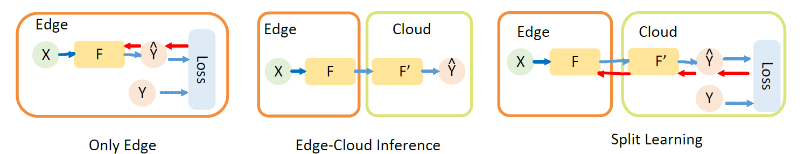

# Privacy-Preserving Split Learning via Patch Shuffling over Transformers

Official Code for ICDM 2022 paper: Privacy-Preserving Split Learning via Patch Shuffling over Transformers  
[Dixi Yao](https://dixiyao.github.io/), Liyao Xiang, Hengyuan Xu, Hangyu Ye, Yingqi Chen  
[[Paper]]() [[BibTex]]() [[Website]]()

## Requirements
```torch, torchvision, timm, eniops```  
```torchlightning``` for attackers

## API of Patch Shuffling
### PatchShuffle
function: ```utilsenc.PatchShuffle(x)->y```  
x: input feature; y: outputfeature
### BatchShuffle  
function: ```utilsenc.BatchPatchPartialShuffle(x,k1)->y```  
x: input feature; k: proportions of patches not to be shuffle; y: outputfeature
### SpectralShuffle
The function is the same as PatchShuffle or BatchShuffle, but first turn models into spectral domain. Please see the example as reference.
### Usage
Place the API of PatchShuffle, BatchShuffle or SpectralShuffle at any place you want to shuffle to feature, in your torch models.  

Normally, in our implementation of privacy-preserving split learning, we place the shuffling operation before the first block of transformer and adding class token.  

For example:  
The model placed on the edge $F$.
```
class F(torch.nn.Module):
    def __init__(self,net,k=1):
        super(F, self).__init__()
        self.model=net
        self.k=k

    def forward_features(self, x):
       with torch.no_grad():
             x = self.model.tokens_to_token(x)
            x =utilsenc.BatchPatchPartialShuffle(x,self.k1,self.k2)
            cls_token = self.model.cls_token.expand(x.shape[0], -1,-1)  # stole cls_tokens impl from Phil Wang, thanks
            x = torch.cat((cls_token, x), dim=1)
            x = self.model.blocks[:1](x)
            x =x[:,1:,:]

    def forward(self, x):
        x= self.forward_features(x)
        return x[:,1:,:]

```
The model placed on the Cloud, F'
```
class rest_F(torch.nn.Module):
    def __init__(self,net,cut_layer):
        super(rest_F, self).__init__()
        self.model = net
        self.cut_layer=cut_layer

    def forward_features(self, x):
        x  = self.model.blocks[self.cut_layer:](x)
        x = self.model.norm(x)
        return x[:, 0]

    def forward(self, x):
        x= self.forward_features(x)
        x = self.model.head(x)
        return x
```
In the model on the edge, we place the shuffling right before adding class token as model strtucture we introduced in our paper.

# Comming Soon
## Examples
celeba k=0.4  
celeba ps+  
cifar10 ps  
cifar10 bs40  
difm ps
## Verify Privacy with Attackers

### BlackBox Attack
celeba ps+
### WhiteBox Attack
celeba ps
### Adaptive Attack
celeba bs40

## Contact
Welcome any discussion and problems: dixi.yao@mail.utoronto.ca or directly propose in git issues.

## Todo
* download trained models from group server
